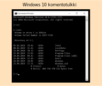

<lead>Tässä aliluvussa esittelemme, mitä tarkoittaa ohjelmien suorittaminen tulkitsemalla. Käsittelemme myös, mitä tarkoittavat käsitteet suorittimen emulointi ja simulointi.</lead>

## Tulkitseminen ja tulkki
Tulkitseminen (tietokonejärjestelmissä) yleensä tarkoittaa sitä, että ohjelma (P) on kuvattu jollain säännöllisellä kuvauskielellä ja että meillä on tuota kuvauskieltä ymmärtävä tulkki-ohjelma. Tulkki (T) pystyy tulkitsemaan ohjelman P toiminnot ja suorittamaan ne järjestelmässä. Tulkki voi olla kirjoitettu millä tahansa ohjelmointikielellä ja se on normaali järjestelmässä suorittava prosessi, jonka esitysmuoto on järjestelmän oma konekieli. 

Tulkki T voisi tietenkin olla myös kirjoitettu jollain toisella säännöllisellä kuvauskielellä, jonka käskyjä tulkitsee joku toinen tulkki T2, jne. Emme käsittele tätä vaihtoehtoa tämän enempää.

Suoritusaikana tulkille syötteenä ohjelma P. Ohjelman P tulkitsemisen aikana järjestelmä käyttäytyy hyvin samoin kuin ohjelma P olisi itse prosessina suorituksessa, mikä tässä on tarkoituskin. Käyttäjälle (ohjelman P suorittajalle) ei ole juurikaan eroa, suoritetaanko P sen kuvausta tulkitsemalla tai sen konekielistä esitysmuotoa suorittamalla.

Käytännössä näillä eri suoritustavoilla on kuitenkin merkittäviä eroja. Tulkittavaa ohjelmaa P ei tarvitse kääntää konekielelle, joten se on hyvin helposti siirrettävissä uuteen järjestelmään. Tämä tietenkin edellyttää, että tulkki T on toteutettu myös uudessa järjestelmässä.  

### Skriptikielet ja niiden tulkit
Tietokonejärjestelmissä on (ehkä mukana olevan graafisen käyttöliittymän lisäksi) aina olemassa komentotulkki-käyttöliittymä. Linux-järjestelmissä komentotulkkeja on useita ja käyttäjä pystyy valitsemaan, mitä niistä hän haluaa käyttää. Tällainen on esimerkiksi [Bourne shell](https://en.wikipedia.org/wiki/Bourne_shell), joka alkuaan kehitettiin Unix-käyttöjärjestelmälle jo 1976. Muita esimerkkejä ovat [C shell](https://en.wikipedia.org/wiki/C_Shell) ja [Bash](https://en.wikipedia.org/wiki/Bash_%28Unix_shell%29).

Windows-järjestelmissä on vain yksi komentotulkki ([Cmd](https://en.wikipedia.org/wiki/Command_Prompt)), joka on ollut käytössä vuodesta 1987.

Jos käyttöjärjestelmässä ei ole graafista käyttöliittymää, sitä käytetään suoraan komentotulkin kautta. Jos siinä on graafinen käyttöliittymä, niin komentotulkin voi käynnistää omaan käyttöliittymän ikkunaan. Esimerkiksi Windows-10 järjestelmässä komentotulkin Cmd voi käynnistää sovelluksena Komentokehote (Command Prompt). Alla olevassa esimerkissä Windows-10 komentotulkille on annettu kaksi komentoa. Komento "C:" vaihtoi hakemiston tiedostojärjestelmän C-partition juureen ja komento "dir" tulosti juurihakemiston tiedot oletusarvoisilla parametreilla.

<!-- kuva: ch-10-1-command-prompt  -->

<illustrations motive="ch-10-1-command-prompt"></illustrations>

Komentotulkkien skriptikielet ovat normaali käyttöliittymä järjestelmien ylläpitäjille. Ne antavat suoran käyttöliittymän järjestelmän hallintaan ja uusien skriptien tekeminen erilaisiin hallintotehtäviin on hyvin helppoa. Skriptejä tulkitsee aina sen oman skriptikielen tulkki, jonka oikeudet määräytyvät sen käynnistämisen yhteydessä. Windows-10:n graafisessa käyttöliittymässä klikkaamalla hiiren oikealla napilla sovellusta Komentokehote (Command Prompt) voidaan pyytää suorittamaan se pääkäyttäjän (admin) oikeuksin. Sen jälkeen komentotulkissa voi tehdä ihan mitä tahansa käyttöjärjestelmän toimintoja. Tehokkailla skripteillä saa paljon hyvää ja pahaa aikaiseksi hyvin kätevästi. 

Komentotulkille voi syöttää skriptejä rivi kerrallaan, kuten edellä olevassa esimerkissä tehtiin. Usein skriptit talletetaan omiin tiedostoihinsa, jotka suoritetaan sellaisenaan komentotulkissa. Linux-järjestelmissä skriptitiedostojen alussa on rivi, joka kertoo mikä skriptikieli siinä on käytössä. Näin skriptejä voi myös "suorittaa", kun käyttöjärjestelmä osaa käynnistää oikean tulkin kullekin skriptille. Käyttäjän näkökulmasta ne tuolloin tuntuvat suoritettavilta ohjelmilta.

## Emulointi
[Emulaattori](https://en.wikipedia.org/wiki/Emulator) tarkoittaa ohjelmaa (tai laitteistoa), jonka kautta käytössä oleva järjestelmä saadaan tuntumaan samalta kuin jokin muu järjestelmä. Esimerkiksi Titokone on ohjelma, joka emuloi ttk-91 suoritinta missä tahansa järjestelmässä, missä Titokoneen voi suorittaa. Titokoneessa on ohjelman sisäisinä tietorakenteina kaikki hypoteettisen ttk-91 suorittimen rekisterit ja muisti. Kaikki ttk-91 ohjelmat voidaan suorittaa Titokoneessa ja ne käyttäytyvät (suoritusaikaa lukuunottamatta) samalla tavalla kuin jos ne olisi suoritettu todellisella ttk-91 suorittimella. 

Intelin hyvin kauan käytössä olleelle X86 suoritinarkkitehtuurille toimivia ohjelmia on valtava määrä ja Intel haluaa, että niiden latausmoduuleja voi suorittaa sellaisenaan (joskus muinoin käännetyssä ja linkitetty konekielisessä muodossa). Tällaisia ohjelmia kutsutaan joskus nimellä "dusty deck" ohjelmat, ...????????????

## Simulointi
????

## Quizit 10.1
<!-- Quiz 10.1.?? -->

<quiz id="4b44871b-2fe7-4fe1-978c-267d5bf8de80"></quiz>

