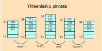

<lead>Tässä aliluvussa esittelemme Java-ohjelmien neljä erilaista mahdollista suoritustapaa. </lead>

[Java](https://fi.wikipedia.org/wiki/Java) on korkean tason olioperustainen ohjelmointikieli. Java-kieliset ohjelmat voisi kääntää ja linkittää ajomoduuleiksi samalla tavalla kuin edellisessä luvussa 9 esitettiin. Näin ei kuitenkaan yleensä tehdä. Korkean tason kielten kääntäjän toteutuksessa on usein osana välikieli, joka toimii siltana kääntäjän _front endin_ ja _back_endin_ välillä. Javassa tuo välikieli on nostettu näkyville erityisasemaan ja käännösmoduulit välitetään eteenpäin Javan välikieliesityksessä eikä Java-kielisinä käännösmoduuleina tai niiden objektimoduuleina.

Javan välikieli on oikealta nimeltään [bytecode](https://en.wikipedia.org/wiki/Java_bytecode) tai [Java bytecode](https://en.wikipedia.org/wiki/Java_bytecode). Käytämme siitä jatkossa nimiä tavukoodi tai Javan tavukoodi.

Javan tavukoodi on hypoteettisen Java virtuaalikoneen ([JVM](https://fi.wikipedia.org/wiki/Java)) konekieltä, ihan samalla tavalla kuin ttk-91 konekieli on hypoteettisen ttk-91 suorittimen konekieltä. Toisin kuin ttk-91 ja sen konekieli, JVM ja sen tavukoodi ovat täydellisesti määriteltyjä.

## Java virtuaalikone JVM ja sen suoritustavat
Java virtuaalikone geneerinen suoritin, joka toimii rajapintana kaikille Java-ohjelmien erilaisille suoritusmuodoille. Kun useimmat todelliset suorittimet sisältävät rekistereitä laskutoimituksia varten, niin JVM:ssä kaikki laskentaa perustuu _pinoon_. Laskutoimitusten argumentit ovat aina pinon pinnalla operaatiossa ne korvautuvat laskutoimituksen tuloksella. Tyypillistä tällaisessa _pinokoneessa_ on, että esimerkiksi add-käskyssä ei tarvitse nimetä operandeja lainkaan, koska ne löytyvät oletusarvoisista paikoista pinon pinnalta. Normaalissa oikeassa suorittimessa add-käskyssä on yleensä nimetty kolme rekisteriä, joista yksi on tulosrekisteri.

Javan virtuaalikone voidaan toteuttaa usealla eri tavalla, mikä tekee tästä mielenkiintoisen ohjelmien suoritusmallin. Suoritettava Java-ohjelma siis aina käännetään ensin JVM:n tavukoodiksi, jonka jälkeen se suoritetaan _jollain tavalla toteutetulla_ JVM:llä. Periaatteessa meillä on ainakin neljä tapaa toteuttaa JVM ja Java-ohjelmia voi sitten suorittaa noilla kaikilla tavoilla. Esittelemme suoritustavat tässä ensin lyhysti ja sitten myöhemmin tarkemmin. 

<!-- Kuva: ch-10-2-java-ohjelmien-suoritus -->

<illustrations motive="ch-10-2-java-ohjelmien-suoritus" frombottom="0" totalheight="40%"></illustrations>

Tulkitseminen tarkoittaa sitä, että meillä on JVM:n tulkki, jossa on kaikki JVM:n rakenteet toteutettu ohjelman tulkin tietorakenteina. Java-tulkki lukee datana tavukoodin käskyjä yksi kerrallaan ja sitten toteuttaa käskyjen aiheuttamat muutokset JVM:n tietorakenteissa. Esimerkiksi iadd-käsky poistaa pinon pinnnalta kaksi kokonaislukua ja tallettaa pinon pinnalle niiden summan. Suoritustapa on hyvin samanlainen kuin miten Titokone lukee ttk-91 konekäskyjä ja emuloi niiden aiheuttamia muutoksia simuloiduissa ttk-91 rekistereissa ja muistissa. Java tulkki on normaali korkean tason kielellä toteutettu ohjelma, joka on käännetty ja linkitetty käytössä olevaan järjestelmään. Järjestelmä voi käyttää mitä tahansa suoritinta, esimerkiksi Intelin Pentium II:sta.

JVM:n voi toteuttaa myös ihan laitteistolla JVM suorittimella, joka suorittaa tavukoodia konekäskyinä. Tämä vastaa tilannetta, jossa (täydellisesti määritelty) ttk-91 toteutettaisiin oikeasti todellisella suorittimella. Tässä tapauksessa latausmoduuli siis sisältää alkuperäisen Java-ohjelman tavukoodisen esityksen ja prosessin suoritusaikana tavukoodi luetaan koodina eikä datana. 

Kolmas vaihtoehto on kääntää ja linkittää ohjelman tavukoodinen esitysmuoto "normaalitapaan" järjestelmän suorittimen konekielelle. Tämä vaihtoehto muistuttaa eniten edellisessä luvussa kuvattua menettelyä, mutta sitä ei yleensä käytetä.

Neljäs vaihtoehto perustuu Just-In-Time käännökseen, jossa kukin viitattu Javan moduuli käännetään ja linkitetään paikalleen vasta tarvittaessa. Tämä on vähän samanlaista kuin dynaamisessa linkityksessä, mutta objektimoduulien asemesta uuden moduulin esitysmuotona on tavukoodi. Lähetymistapa on joustavaa. Tavukoodi on geneeristä, mutta objektimoduulien koodi on jollain tietyllä konekielellä. Dynaamisen linkittäjän lisäksi tarvitaan nyt myös tavukoodin kääntäjä natiiviympäristön suorittimelle.

### JVM:n pino

Java virtuaalikoneessa on pino, jossa on ohjelman tietorakenteet, välitulokset ja aktivaatiotietueita vastaavat _kehykset_. Pinossa on siis mm. kaikki ohjelman muuttujat ja laskennan välitulokset. Tämä on hyvin erilainen lähetymistapa kuin todellisissa suorittimissa yleinen tapa säilyttää muuttujien arvoja ja laskennan välituloksia nopeissa rekistereissä. Jos JVM toteutetaan rekisterikoneessa, niin toteutusta voi hidastaa se, että kaikki tieto on aina muistissa olevassa pinossa.

Pinolle on normaalien push/pop-käskyjen lisäksi JVM:ssä myös kehyksille on omat push/pop-käskynsä, jolloin niitä ei tarvitse rakentaa ja purkaa sana kerrallaan. 

JVM:n pinon ei tarvitse olla yhtenäisellä muistialueella, vaan se allokoidaan _keosta_. Pinon koko voi olla rajallinen tai laajennettavissa dynaamisesti, jolloin pinon muistitilan loppuessa sille allokoidadan lisäämuistitilaa keosta.

Pinoon osoittaa kaksi rekisteriä. SP (stack pointer) osoittaa pinon päällimmäiseen alkioon ja LV (local variables) nykykehyksen ensimmäiseen paikalliseen muuttujaan. Kumpaakaan näistä rekistereistä (kuten ei muitakaan JVM:n rekistereistä) ei mitenkään nimetä JVM:n konekäskyissä, vaan kaikki rekisteriviittaukset ovat implisiittisiä. Esimerkiksi add-käsky viittaa dataan aina SP:n kautta, vaikka SP:tä ei mitenkään nimetä konekäskyssä.

<!-- Kuva: ch-10-2-yhteenlasku-pinossa -->

<illustrations motive="ch-10-2-yhteenlasku-pinossa" frombottom="0" totalheight="40%"></illustrations>

### JVM:n tietorakenteet, pinot, keot, metodiallas, vakioallas
????

### Metodin kehys
????

## Tavukoodi (byte code)

### Tiedonosoitusmoodit, käskyt
????

## Natiivimetodit ja niiden pinot
????

## Quizit 9.2
<!-- Quiz 9.2.?? -->

<quiz id="4b44871b-2fe7-4fe1-978c-267d5bf8de80"></quiz>

