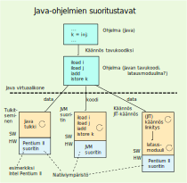

<lead>Tässä aliluvussa esittelemme Java-ohjelmien neljä erilaista mahdollista suoritustapaa. </lead>

[Java](https://fi.wikipedia.org/wiki/Java) on korkean tason olioperustainen ohjelmointikieli. Java-kieliset ohjelmat voisi kääntää ja linkittää ajomoduuleiksi samalla tavalla kuin edellisessä luvussa 9 esitettiin. Näin ei kuitenkaan yleensä tehdä. Korkean tason kielten kääntäjän toteutuksessa on usein osana välikieli, joka toimii siltana kääntäjän _front endin_ ja _back_endin_ välillä. Javassa tuo välikieli on nostettu näkyville erityisasemaan ja käännösmoduulit välitetään eteenpäin Javan välikieliesityksessä eikä Java-kielisinä käännösmoduuleina tai niiden objektimoduuleina.

Javan välikieli on oikealta nimeltään [bytecode](https://en.wikipedia.org/wiki/Java_bytecode) tai [Java bytecode](https://en.wikipedia.org/wiki/Java_bytecode). Käytämme siitä jatkossa nimiä tavukoodi tai Javan tavukoodi.

Javan tavukoodi on hypoteettisen Java virtuaalikoneen ([JVM](https://fi.wikipedia.org/wiki/Java)) konekieltä, ihan samalla tavalla kuin ttk-91 konekieli on hypoteettisen ttk-91 suorittimen konekieltä. Toisin kuin ttk-91 ja sen konekieli, JVM ja sen tavukoodi ovat täydellisesti määriteltyjä.

## Java virtuaalikone JVM
Java virtuaalikone geneerinen suoritin, joka toimii rajapintana kaikille Java-ohjelmien erilaisille suoritusmuodoille. Kun useimmat todelliset suorittimet sisältävät rekistereitä laskutoimituksia varten, niin JVM:ssä kaikki laskentaa perustuu _pinoon_. Laskutoimitusten argumentit ovat aina pinon pinnalla operaatiossa ne korvautuvat laskutoimituksen tuloksella. Tyypillistä tällaisessa _pinokoneessa_ on, että esimerkiksi add-käskyssä ei tarvitse nimetä operandeja lainkaan, koska ne löytyvät oletusarvoisista paikoista pinon pinnalta. Normaalissa oikeassa suorittimessa add-käskyssä on yleensä nimetty kolme rekisteriä, joista yksi on tulosrekisteri.

Javan virtuaalikone voidaan toteuttaa usealla eri tavalla, mikä tekee tästä mielenkiintoisen ohjelmien suoritusmallin. Suoritettava Java-ohjelma siis aina käännetään ensin JVM:n tavukoodiksi, jonka jälkeen se suoritetaan _jollain tavalla toteutetulla_ JVM:llä.  

<!-- Kuva: ch-10-2-java-ohjelmien-suoritus -->

<illustrations motive="ch-10-2-java-ohjelmien-suoritus" frombottom="0" totalheight="40%"></illustrations>

## Tietorakenteet, pinot, keot, metodiallas, vakioallas
????

## Metodin kehys
????

## Tavukoodi (byte code)

### Tiedonosoitusmoodit, käskyt
????

## Natiivimetodit ja niiden pinot
????

## Quizit 9.2
<!-- Quiz 9.2.?? -->

<quiz id="4b44871b-2fe7-4fe1-978c-267d5bf8de80"></quiz>

