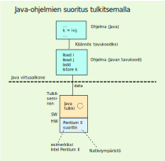

<lead>Tässä aliluvussa (10.3) esittellään neljä erilaista tapaa toteuttaa Java virtuaalikone (JVM) ja kuinka Java-ohjelmia suoritetaan niissä. 
</lead>

## Java-tulkki
Helpoin tapa suorittaa Java-ohjelmia on rakentaa Java-tulkki, joka emuloi JVM:n toimintaa omien tietorakenteidensa avulla. Java-tulkissa on emuloitu JVM:n rekisterit SP, LV, CPP ja PC. Samoin siellä suuret taulukot, joiden avulla emuloidaan JVM:n kekoa, pinoa, vakioallasta ja metodialuetta. 

<!-- Kuva: ch-10-3-suoritus-tulkki -->

<illustrations motive="ch-10-3-suoritus-tulkki" frombottom="0" totalheight="40%"></illustrations>

Java tulkki alustaa ensin JVM:n. Tavukoodin on yksinkertaista, koska JVM:ssä on tarkalleen määritelty jokaisen tavukoodisen käskyn toiminnot. Tulkki muokkaa emuloituja JVM:n rakenteita yksi tavukoodin käsky kerrallaan. 

Tämä on hyvin joustava tapa suorittaa tavukoodia. Jos koodissa tapahtuu viittaus johonkin muuhun Java-luokkaan, siirrytään suorittamaan sen tavukoodia. Tarvittaessa se voidaan ladata tässä vaiheessa levyltä tai jopa verkosta, koska tavukoodiset tiedostot ovat tavallista dataa tulkille. 

Heikkoutena tässä suoritustavassa on suorituksen näennäinen hitaus. Koska tavukoodin käskyjä suoritetaan vain yksi kerrallaan, normaalin suorittimen erilaisia suoritusnopeuden optimointimenetelmiä on vaikea käyttää. Toisena heikkoutena on jo aikaisemmin mainittu pipnokoneen emuloinnin vaikeus rekisterikoneella, koska lähes kaikki viiteeet kohdistuvat muistissa oleviin tietorakenteisiin. Tottakai tulkki voi säilyttää JVM:n rekistereitä SP, LV,CPP ja PC omissa rekeistereissään, mutta se ei paljoa auta.

Java-tulkki on hyvin samanlainen siis kuin ttk-91 tietokoneen tulkki Titokone-ohjelmassa. Titokone lukee datana ttk-91 koneen "konekieltä" yksi konekäsky kerrallaan ja tekee sen aiheuttamat muutokset emuloituihin ttk-91 rekistereihin ja muistiin. Ttk-91 suorittimen rekisterit ja muisti ovat tavallisia tietorakenteita Titokoneessa.

## Kääntäminen natiivikoneelle
Java-ohjelma voidaan kääntää ja linkittää natiivikoneelle, samalla tavalla kuin edellisessä luvussa esitettiin. Tämä tarkoittaa, että Java-ohjelmasta tehdään tavallinen käyttöjärjestelmän tunnistama prosessi, joka suorittaa järjestelmän suorittimen konekielistä koodia.

<!-- Kuva: ch-10-3-suoritus-kaannos -->

<illustrations motive="ch-10-3-suoritus-kaannos" frombottom="0" totalheight="40%"></illustrations>

Kääntäminen järjestelmän omalle konekielelle tehdään nyt kuitenkin tavukoodisesta esitysmuodosta. Edellisen luvun terminologian mukaisesti kääntämisessä tarvitsee nyt ajaa ainoastaan kääntäjän _back end_. Etuna konekielelle kääntämisestä on ohjelman suorituksen nopeus, koska kääntäjä voi tehokkaasti optimoida koodin juuri tälle suorittimelle. 

Käännöksen natiivikoneen konekielelle voi tehdä myös vähän "huijaten" hyödyntäen C-kielen kääntäjää. Näin tehdään sen vuoksi, että todella hyvin optimoidun koodin tekeminen on vaikeata ja kuitenkin liki jokaisesta käyttöjärjestelmästä löytyy hyvin optimoitua koodia tuottava C-kielen kääntäjä jo valmiina eri suorittimille. Tässä tapauksessa tavukoodi käännetään ensin C-kielelle, mikä on suhteellisen helppoa. C-kielinen esitysmuoto annetaan sitten C-kääntäjälle, joka tuottaa hyvin optimoitua koodia halutulle suorittimelle.

Huonona puolena natiivikoneelle kääntämisestä on joustamattomuus, koska koko ohjelma täytyy kokonaisuudessaan kääntää ja linkittää valmiiksi latausmoduuliksi. Dynaamista linkitystä ei voi käyttää. 

Yleensä Java-ohjelmia ei suoriteta tällä tavoin. 

## Just-In-Time (JIT) kääntäminen
Yleisin tapa suorittaa Java-ohjelmia on [Just-In-Time (JIT) kääntäminen](https://en.wikipedia.org/wiki/Just-in-time_compilation). Se on yleisesti ottaen sekamuoto tulkitsemisesta, kääntämisestä ja dynaamisesta linkittämisestä. 

Ohjelman suoritus alkaa tulkitsemalla tavukoodista pääohjelmaa. Kun ohjelma suoritusaikana kutsuu uutta (Java) luokkaa, niin suoritus pysähtyy, kunnes tämä uusi luokka on käännetty natiivikoodiksi ja linkitetty paikalleen tulkin yhteyteen. Tämä voi viedä paljonkin aikaa ja muistitilaa, koska kääntäjän ja dynaamisen linkittäjän pitää olla suorituksessa järjestelmässä.

Käännös ja linkitys tehdään yleensä heti luokan ensimmäisen metodin (aliohjelman) kutsun yhteydessä, mutta sen voi tehdä myöhemminkin. Jos esimerkiksi ison luokan pientä metodia kutsutaan vain kerran, niin voisi olla nopeampaa tulkita se tavukoodina. Tällaisessa tapauksessa suoritusnopeutta voi optimoida tekemällä JIT-käännös esimerkiksi vasta saman metodin toisen kutsukerran yhteydessä. Laskentaa kontrolloivan tulkin pitää joka tapauksessa päättää, milloin tavukoodina esitetty luokka kannattaa kääntää järjestelmän konekielelle.

Hyvin optimoidun koodin tuottaminen JIT-käännöksen yhteydessä keskeyttää ohjelman suorituksen vielä pidemmäksi aikaa. Tämän vuoksi kirjastomoduulit on hyvä olla suoraan käytettävissä natiivikoodisina objektimoduuleina, jolloin suorituksen jatkumiseksi riittää linkittää ne dynaamisesti paikalleen. Kirjastomoduulit on voitu myös kirjoittaa jollakin toisella ohjelmointikielellä (esim. C:llä tai C++:lla), jolloin niiden koodin optimointi on ollut ehkä helpompi toteuttaa.

Kokonaisrakenne on monimutkainen, koska Java-tulkin käyttämien JVM-tietorakenteiden (rekisterit, muistialueet) täytyy olla myös käännettyjen natiivikoodimoduulien käytettävissä.

<!-- Kuva: ch-10-3-suoritus-jit -->

<illustrations motive="ch-10-3-suoritus-jit" frombottom="0" totalheight="40%"></illustrations>

## Java-suoritin
????

<!-- Kuva: ch-10-3-suoritus-natiivi -->

<illustrations motive="ch-10-3-suoritus-natiivi" frombottom="0" totalheight="40%"></illustrations>

## Quizit 10.3 ????
<!--  quizit 10.3.???  -->

<quiz id="4b44871b-2fe7-4fe1-978c-267d5bf8de80"></quiz>

