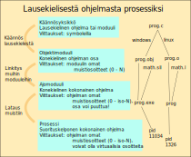

<lead>Tässä luvussa 9 esittelemme, kuinka korkean tason kielellä (esim. Java tai C) kirjoitetusta ohjelmasta saadaan järjestelmän suorittimella suoritettava prosessi. Vaiheet ovat kääntäminen, linkittäminen ja lataaminen. 
  
Seuraavassa luvussa 10 käsitellään toisenlainen ohjelmien suoritustapa tulkitsemalla, jossa annettua ohjelmaa suorittaakin toinen ohjelma (tulkki), joka on suorituksessa suorittimella. </lead>

## Lausekielestä prosessiksi
Tavanomainen tapa suorittaa ohjelmia on tehdä niistä käyttöjärjestelmän tunnistama prosessi, jonka konekielisiä käskyjä suoritin suorittaa. Ohjelmien kirjoittaminen konekielellä on jonkin verran työlästä, minkä vuoksi on kehitetty ensin symbolisia konekieliä ja sitten korkean tasonkieliä. Ttk-91 koneen symbolinen konekieli on hyvä esimerkki. On paljon mukavampaa kirjoittaa koodia käyttäen symbolista konekieltä kuin puhdasta numeerista konekieltä. Ennen suoritusta symbolinen konekieli pitää kuitenkin sitten kääntää konekielelle ja palaamme tähän käännökseen vähän myöhemmin.

Korkean tason kielet on kehitetty ohjelmoijan näkökulmasta. Kukin korkean tason kieli antaa vähän erilaisen ajattelun välineen jonkin ohjelmointiongelman ratkaisemiseksi. Ohjelmoinnin ammattilaiset osaavat useita ohjelmointikieliä ja yleensä ensimmäinen vaihe ohjelmointiprojektissa on valita juuri siihen ongelmaan sopiva ohjelmointikieli. Puhtaan numeerisen laskennan määrittelyyn paras ohjemointikieli voisi olla Fortran tai C, tietokannan toiminnan kuvaamiseen SQL, monimutkaisen sumean logiikan kuvaamiseen Prolog tai Lisp, jne. Usein kielen valintaan vaikuttaa myös oman organisaation ohjelmointistandardit, jolloin standardoinnin tarve voi olla tärkeämpää kuin ongelman ratkaisu siihen parhaiten sopivalla kielellä.

Isossa ohjelmointiprojektissa voi olla useita eri osia, joista kukin voidaan ratkaista siihen sopivimmalla ohjelmointikielellä.
Lisäksi ohjelmoinnissa pyritään hyödyntämään aikaisemmin tehtyä työtä. Käytännössä tämä tarkoittaa esimerkiksi ikivanhan suuren Fortranilla kirjoitetun ohjelmistopaketin käyttöä, koska se on edelleen joiltakin osin hyvin käyttökelpoinen eikä organisaatio halua sijoittaa resursseja sen uudelleenohjelmointiin.

Hyvin tyypillistä ohjelmoinnissa on käyttää valmiita kirjastomoduuleja. Niistä on useita hyötyjä. Ennen kaikkea ne on (yleensä) hyvin ohjelmoitu, joten niiden testaamiseen ei tarvitse käyttää kovin paljoa aikaa. Ne sisältävät hyvin optimoitua kooodia, joten ne suorittavat nopeasti. Kirjastomoduulit voivat olla käyttöjärjestelmän antamia palveluja tai sitten ne voivat liittyä johonkin tiettyyn ohjelmointikieleen. Käyttöjärjestelmän kirjastomoduulit voivat ehkä suorittaa etuoikeutetussa tilassa ja käyttää suoraan laitteistoa. 

### Käännösyksikkö
Korkean tason kielellä (kielillä) toteutetussa ohjelmassa perusyksikkö on _käännösyksikkö_. Ohjelma koostuu useasta käännösyksiköstä, joista kukin käännetään yksi kerrallaan. Tämä helpottaa suurenkin ohjelmiston kehitystyötä, kun suuri ohjelmisto koostuu pienemmistä käännösyksiköistä, jotka kukin ratkaisevat jonkin pienemmän osa ongelman. Esimerkiksi käyttöliittymä ihmiseen voisi olla oma käännösyksikkönsä, samoin kuin matriisien kertolasku.

Käännösyksikössä ei ole vielä mitään muistiosoitteita ("osoiteavaruus"), vaan kaikki viittaukset muuttujiin, tietorakenteisiin ja ohjelman osoitteisiin tehdään kyseisen korkean tason ohjelmointikielen symbolien avulla.  

Linux- ja window-järjestelmissä C-kieliset käännösyksiköt nimetään loppuliitteellä _.c_. Pieni ohjelma voi koostua vain yhdestä käännösyksiköstä, esim. _prog.c_. Kääntäjä kääntää käännösyksiköt yksi kerrallaan _objektimoduuleiksi_.

### Objektimoduuli
Objektimoduulissa koodi on tietyn suorittimen konekieltä. Käännösyksikön muistiosoitteita vastaavat symbolit on nyt muutettu muistiosoitteiksi tämän käännösyksikön omaan _osoiteavaruuteen_. Kukin objektimoduuli on suhteellisen pieni, joten sen osoiteavaruuskin on suhteellisen pieni, esim. 0-4765, 0-234567 tai 0-87654321. Jokaisella objektimoduulilla on ihan oma nollasta alkava osoiteavaruutensa, johon kaikki koodi- ja data muistiviitteet kohdistuvat.

Linuxissa tavallisen käännetyn objektimoduulin nimen loppuliite on _.o_, mutta kirjastojen objektimoduulien loppuliite on _.l_. Muutoin kirjastojen objektimoduulit ovat ihan samanlaisia ja ne on käännetty (suoritusaikaa optimoiden) samanlaisista käännösyksiköistä. Windows-järjestelmissä objektimoduulien loppuliite tavallisilla objektimoduuleilla on _.obj_ ja kirjastomoduuleilla _.sll_ (tai _.dll_, mutta emme käsittele niitä nyt). 

Esimerkkimme ohjelman _prog.c_ objektimoduuli linux-järjestelmässä olisi nimeltään _prog.o_ ja sen käyttämä matematiikkakirjasto (sen objektimoduuli) _math.l_. Windows-järjestelmissä nuo moduulit olisivat vastaavasti _prog.obj_ ja _math.sll_.

### Ajomoduuli eli latausmoduuli
Käännösyksiköistä käännetyt objektimoduulit linkitetään yhteen _ajomoduuliksi_. Ajomoduulissa yksittäisten objektimoduuliensooiteavaruudet täytyy yhdistää, mikä on jonkin verran hankala tehtävä. Esimerkiksi, jos muuttujan X osoite objektimoduulissa _prog.o_ oli 0x0A57, niin ajomoduulissa se voi olla 0x00045424 ja kaikki viittaukset osoitteeseen 0x0A57 moduulissa _prog.o_ täytyy päivittää arvoon 0x00045424.

### Prosessi
??????????

<-- Kuva: ch-9-1-lausek-suoritukseen -->

<illustrations motive="ch-9-1-lausek-suoritukseen" frombottom="0" totalheight="40%"></illustrations>

### Käännös
????

### Objektimoduuli ja symbolitaulu
????

### Makrot
????

### Literaalit
????

## Linkitys
???

## Lataus
????

## Quizit 9.1
<!-- Quiz 9.1.?? -->

<quiz id="4b44871b-2fe7-4fe1-978c-267d5bf8de80"></quiz>

